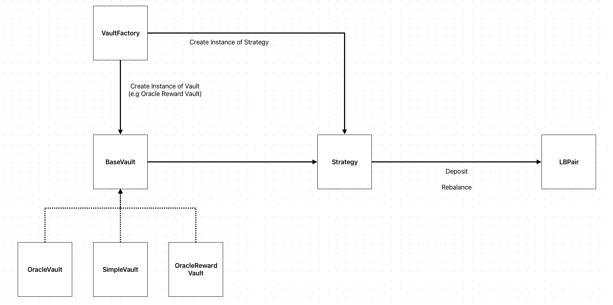
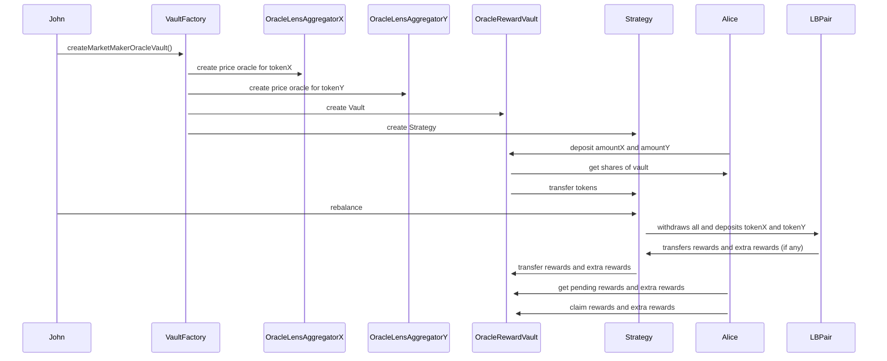

# Vault Overview

The vaults are a fork from LFJ. The original code can be found here: https://github.com/traderjoe-xyz/autopools

## Vault components
This following diagram gives a overview of the vault componentes:

All components briefly explaind:
- BaseVault is the base contract for OracleVault, OracleRewardVault and SimpleVault
- Strategy holds token balances and deposits/withdraws funds to/from LB pairs
- Vault and Strategy are created by the VaultFactory

Differences between the vault types:
- SimpleVault is a basic vault implemention which needs a certain token ratio on deposits and withdraws
- OracleVault needs additional Oracles for each token to calculate the token ratio. Deposits dont need a certain ratio and also single sided deposits (only one token) are possible
- OracleRewardVault is like the OracleVault but also handle token rewards if the LP Pair has additional rewards (e.g. LUM) from LB Hook Rewarder ([lb-rewarder](https://github.com/MagicSea-Finance/lb-rewarder))

The SimpleVault is not used in production. We keep it for historic reasons.

## BlueLabs Maker Vaults

We introduced another function `createMarketMakerOracleVault` on `VaultFactory` contract, which lets advanced users create their own vaults where they can act as operators. This is a key change, because on the LFJ vaults the vaults get managed by automatic keepers. The automatic approach has certain limits like rigid strategy, slowness on quick market changes, etc.

With maker vaults users can act like fund managers for other users and realize their own market strategy.

Vault managers will also have the possibilty to set their own percantage of AUM fee. The fee is a performance fee and is charged on every rebalance. 

## Handling of rewards

With the introdcution of LB Farms on MagicSea, LBPairs can have token rewards (e.g. LUM). This is realized with LBHookRewarders, which are hooks on LBPairs and payout LUM to to LBPair holders. 
The OracleRewardVault can't handle the additional rewards. So we introduced the OracleRewardVault which handles rewards and let user view and claim their pending rewards.

We introduced a couple of changes to Strategy and BaseVault:

- Abstract functions `_updatePool` and `_modifyUser` which get called on variouse functions like `deposit`, `withdraw`, eg. to let vault implemenation handle and track the user reward
- The `Strategy` checks the existence of hook rewards and extra rewards (dual token rewards). On every rebalance the rewards get payout to the Strategy which transfer them to the vault
- The `OraceRewardVault` holds user data and keeps track for the reward debt. On every reward transfer the internal accrued reward share will get updated.

## Lifecycle of Maker Vaults

Maker Vaults can created by any user on the `VaultFactory`. As soon users deposit tokens on the vault the strategy can be put to work by calling `rebalance`. On every `rebalance` the operator (vault manager) can (almost) freely set the bin range (<= range limit) and liquidity proportion. 
If vault managers dont like to operate the vault anymore they can call `submitShutdown()` which signals the end of lifecycle. 

## Example sequence flow

Here you can an example interfaction with the various components:

# Oracles

The maker vault is initialized with a price lens (`IPriceLens`) which aggregates oracle prices and on chain pair spot prices. The prices are important for evaluting the share value when user deposits to the vault.
Based on past audit recommmendations we added an additional twap price check to hamper potential spot price manipulations.
